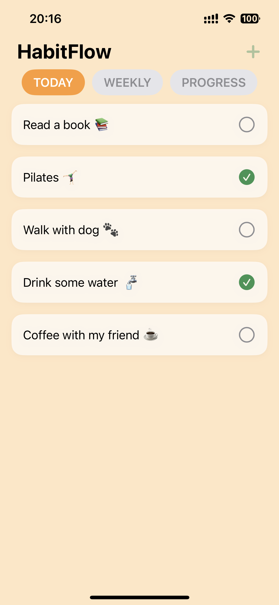
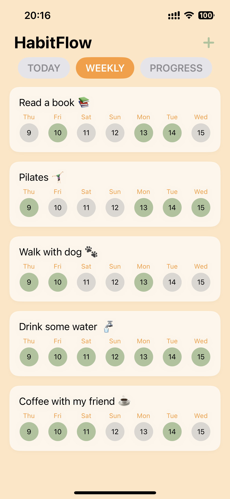
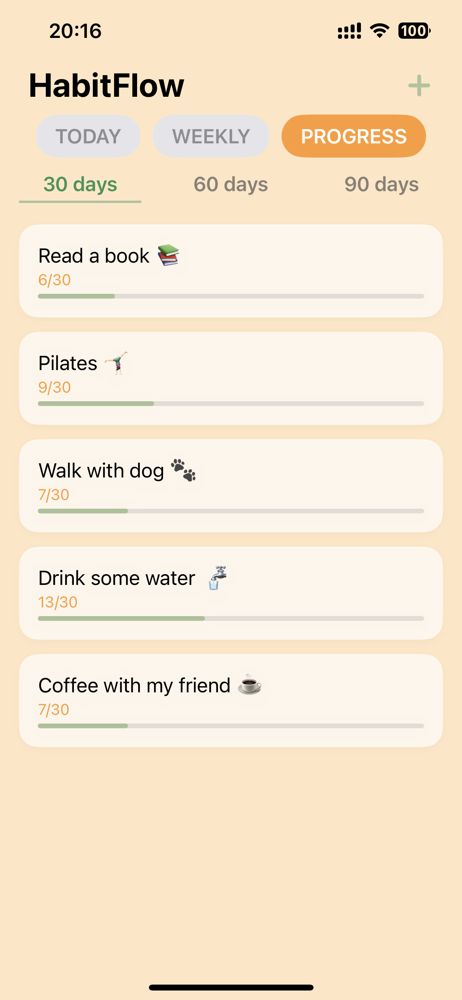
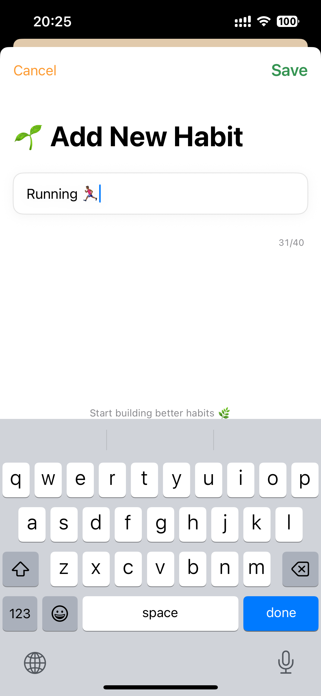
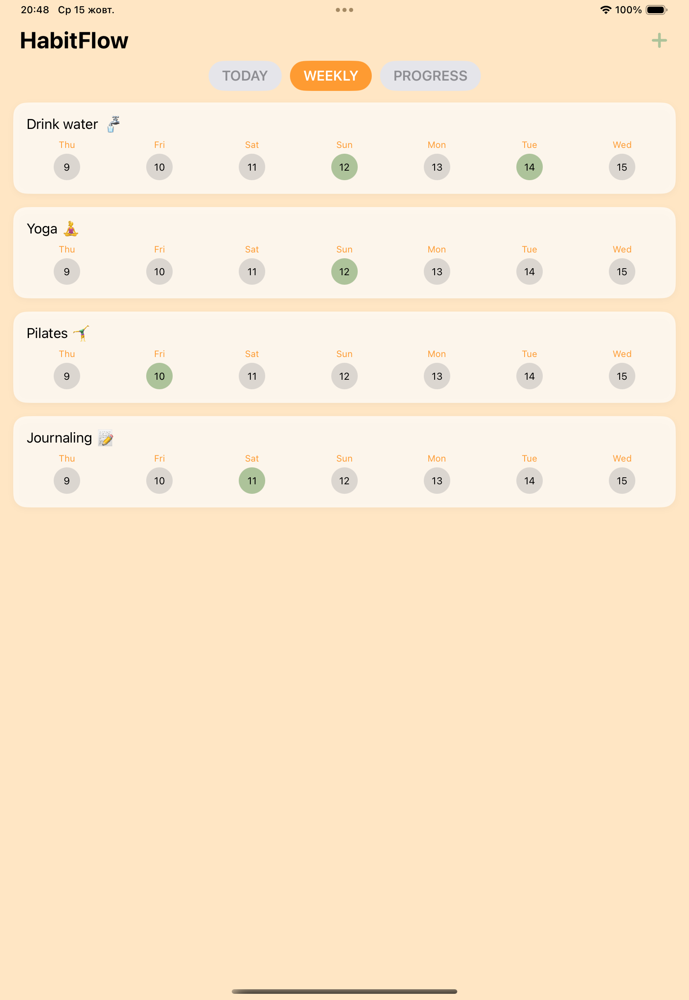

# 🪴 HabitFlow  
*A minimalist habit tracker that focuses on consistency, not streaks.*

---

## 🌟 Overview
**HabitFlow** is an iOS habit tracker built with **SwiftUI** and **Realm**, designed to help users stay consistent without pressure.  
It visualizes habits over time, emphasizing regularity instead of perfection — because real progress comes from steady effort.

---

## 📋 Table of Contents
- [Overview](#-overview)
- [Features](#-features)
- [Tech Stack](#-tech-stack)
- [Screenshots](#-screenshots)
- [Key Takeaways](#-key-takeaways)
- [Future Ideas](#-future-ideas)
- [How to Run](#-how-to-run)
- [Author](#-author)

---
## ✨ Features
- Add, edit, and delete habits easily  
- Track weekly and overall progress  
- Clear and motivating visual feedback  
- Smooth transitions between views  
- Local data persistence with Realm  
- Optional UserDefaults mode for testing  
- Adaptive layout for both iPhone and iPad  
- Light mode design for a clean and calm look  

---

## 🧱 Tech Stack
| Category | Technology |
|-----------|-------------|
| **Language** | Swift (SwiftUI) |
| **Frameworks** | SwiftUI, Realm, Foundation |
| **Architecture** | MVVM |
| **Persistence** | Realm (with optional UserDefaults fallback) |
| **Design** | Custom SwiftUI interface in a clean light theme |
| **Supported Devices** | iPhone, iPad |

---

## 📱 Screenshots
| View | Description |
|------|--------------|
| **Today View** | Daily list of active habits with quick completion toggle |
| **Weekly View** | 7-day visualization with adaptive grid layout |
| **Progress View** | Overview of consistency trends |
| **Add Habit View** | Styled input with auto-focus and live character counter |
| **iPad Layout** | Adaptive interface for larger screens |

**Today View**  


**Weekly View**  


**Progress View**  


**Add Habit View**  


**iPad Layout**  


---

## 💡 Key Takeaways
While developing **HabitFlow**, I focused on building production-like quality even within a pet project:
- Creating adaptive SwiftUI layouts that scale across devices  
- Applying MVVM architecture for clear data flow  
- Managing local persistence with Realm and lightweight alternatives  
- Handling keyboard focus, validation, and user-friendly details  
- Polishing UI/UX with smooth transitions and clear hierarchy  

---

## 🚀 Future Ideas
HabitFlow is fully functional and ready to use.  
However, there’s room for exciting improvements in future versions:
- 🔔 Reminders and notifications  
- ☁️ Cloud sync using CloudKit  
- 📊 Widgets or home screen summaries  

These features are not essential for the current version but could enhance user experience later.

---

## 🧰 How to Run
1. Clone the repository:  
   ```bash
   git clone https://github.com/zakharova-d/HabitFlow.git
2.    Open HabitFlow.xcodeproj in Xcode 16 (or newer).
3.    Select a target device or simulator and press Run (⌘ + R).

No external dependencies are required — Realm is managed via Swift Package Manager.

⸻

## 🪶 Author

Developed with care by Daria Zakharova

💌 Connect with me on [LinkedIn](https://www.linkedin.com/in/zakharovaa-d/)

⸻

